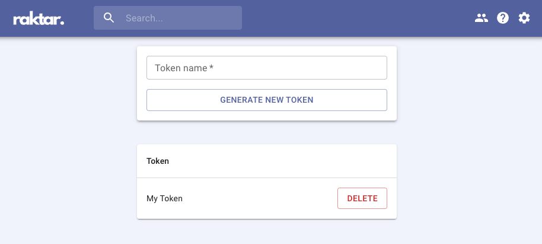

# How to configure Cargo to use the private registry?
You can name the private registry whatever you want locally.
Let's use the name "raktar" for example.

Add a new entry in the Cargo configuration file for the registry with
the index url.

```toml
[registries.raktar]
index = "{index-url}"
```

You can find the index URL in the `help` section of the website.


Cargo configuration files follow a hierarchical structure.
Please refer to the
[official documentation](https://doc.rust-lang.org/cargo/reference/config.html)
for more details on locating the appropriate configuration file.

Run the following command to configure a new token for the registry:
```sh
cargo login --registry raktar
```

it will prompt you to paste a new token. Click the URL in the prompt,
it should take you to the tokens page within the app, where you can generate a token.



If you weren't already logged into the web application, the redirect may not work.
You can also access the tokens page from within the app through the cog in the top
right corner.

That should be it - you are now ready to use the registry.

# How to use dependencies published to the registry?
Specifying a dependency in the private registry is as simple as passing
in the `registry` flag in the `Cargo.toml`, e.g.

```toml
[dependencies]
private_crate = { registry = "raktar", version = "0.1.1" }
```

Unfortunately, proper authentication for private registries is not stabilised
yet in Rust. You need use the nightly build for things to work.

Make sure `nightly` is installed:
```sh
rustup toolchain install nightly
```

You can configure your project to use `nightly` by adding a
`rust-toolchain.toml` to the root directory of the project with

```toml
[toolchain]
channel = "nightly"
```

The last thing you need to do is passing in the `-Z registry-auth` flag
when running Cargo commands, e.g.

```sh
cargo build --registry raktar -Z registry-auth
```

# How to publish a new crate?
```sh
cargo publish --registry raktar -Z registry-auth
```
